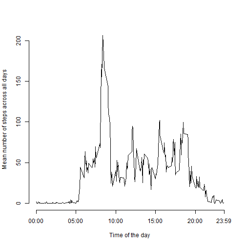

## Loading and preprocessing the data  
The data will be already present in the repository so there is no need to download it.

Unzipping and reading the data.  

```r
unzip("./Data/activity.zip", exdir="./Data")
activity<-read.csv("./Data/activity.csv")
```
Setting the local language to english, to work with weekdays (my computer settings are in Spanish).  

```r
Sys.setlocale("LC_TIME", "English")
```
Storing the activity intervals as a numeric variable for later use with the plots.  

```r
intervalsnum<-as.numeric(unique(activity[,"interval"]))
```
The format of the interval column is changed to match time format HH:MM.  

```r
temp2 <- mapply(function(x, y) paste0(rep(x, y), collapse = ""), 0, 4 - nchar(activity[,"interval"]))
activity[,"interval"]<-paste0(temp2, activity[,"interval"])
activity[,"interval"]<-format(strptime(activity[,"interval"], format="%H%M"), format = "%H:%M")
```
Switch the format of the date column to actually be recognised as a Date. Not a factor.  

```r
activity[,"date"]<-strftime(activity[,"date"],format="%Y-%m-%d")
```
Getting vectors with all the diferent dates and times, with one element for each day and one for each 5 minute fraction respectively.   

```r
dates<-as.Date(unique(activity[,"date"]))
intervals<-unique(activity[,"interval"])
```
A new variable "steps" is created that contains the sum of all steps taken in one day. The NA values are dropped.  

```r
steps<-mapply(function(x) sum(activity[activity[,"date"]==x,"steps"],na.rm=T), dates)
```
## What is mean total number of steps taken per day?  
To calculate the mean and the median of the number of steps taken each day we use the previous variable "steps".  

```r
mean(steps)
```

```
## [1] 9354
```

```r
median(steps)
```

```
## [1] 10395
```
 We can also draw a histogram of the number of steps taken each day.  

```r
hist(steps, xlab="number of steps per day",main="Steps per day")
```

 

## What is the average daily activity pattern?  
Using mapply again we calculate the mean number of steps taken each day at each 5 minute time fraction. After that we plot it in a line graph so we can see the pattern across a day. The x axis is modified to accomodate labels which format indicates clearly that we are talking of 24:00 hour samples.  

```r
stepstime<-mapply(function(x) mean(activity[activity[,"interval"]==x,"steps"],na.rm=T), intervals)
plot(intervalsnum,stepstime,type="l",axes=FALSE,xlab="Time of the day",ylab="Mean number of steps across all days")
  axis(side=1,at=c(0,500,1000,1500,2000,2359), labels=c("00:00","05:00","10:00","15:00","20:00","23:59"))
  axis(side=2,at=c(0,50,100,150,200), c(0,50,100,150,200))
```

 

We can also see that, on average, the 5 minute interval where the most steps are taken is at 08:35  

```r
which.max(stepstime)
```

```
## 08:35 
##   104
```

## Imputing missing values  

The first step will be to calculate how many rows have NA's.  

```r
Nodata<-is.na(activity[,"steps"])
length(Nodata[Nodata==TRUE])
```

```
## [1] 2304
```

After that the data is going to be modified in order to switch all the NA data with the average across all days for the same 5 minute fraction.  

A vector is created where all the "NA" values are substituted by the mean of the same time point across all days

```r
correctedsteps <- ifelse(Nodata, stepstime, activity[,"steps"])
```

And then a new dataset is assembled changing the steps column by the new column that has been filled with the averages for each 5 minute fraction.  
The Date column is also reformatted to have again Date format.  
So this dataset is essentially the same dataset that we had at the beginning but with the NA values substituted.

```r
correctedactivity<-cbind(correctedsteps,activity[,c(2,3)])
correctedactivity[,"date"]<-as.Date(correctedactivity[,"date"])
```

The sum of the number of steps is calculated again for each day, with the NA data filled.

```r
steps2<-mapply(function(x) sum(correctedactivity[correctedactivity[,"date"]==x,"correctedsteps"],na.rm=T), dates)
```


Then the corrected values can be plotted again in a histogram and we have a mean of 10766 and a median of 10766 based on the new data set.  


```r
mean(steps2)
median(steps2)
```

```r
hist(steps2, xlab="number of steps per day",main="Steps per day")
```

 

From the data obtained in this new transformation of the original data we can see that the median and the mean have increased and are equal. This indicates a reduction in the number of outliers, that can also be observed in both histograms.  
The last histogram has a much better fit to a gaussian bell, and also the number of days in the range of 0 to 5000 steps has decreased greatly.  
Therefore it can be said that the inclusion of the mean values in place of the NA's has reduced the spread of the data.


## Are there differences in activity patterns between weekdays and weekends?  
In this part of the code we take the new data set and modify the data so we can set a new factor. The date at which the data was taken is classified in two levels:  
* weekdays
* weekend


```r
correctedactivity[,"date"]<-weekdays(correctedactivity[,"date"])
correctedactivity[,"date"]<- ifelse(correctedactivity[,"date"]=="Saturday", "weekend", correctedactivity[,"date"])
correctedactivity[,"date"]<- ifelse(correctedactivity[,"date"]=="Sunday", "weekend", correctedactivity[,"date"])
correctedactivity[,"date"]<- as.factor(ifelse(correctedactivity[,"date"]=="weekend", correctedactivity[,"date"],"weekday"))
```

The data is divided between weekdays and weekends

```r
CAweekday<-correctedactivity[correctedactivity["date"]=="weekday",]
CAweekend<-correctedactivity[correctedactivity["date"]=="weekend",]
```
Then the average number of steps is calculated in both weekdays and weekends

```r
stepstimeWD<-mapply(function(x) mean(CAweekday[CAweekday[,"interval"]==x,"correctedsteps"],na.rm=T),SIMPLIFY=F, intervals)
stepstimeWE<-mapply(function(x) mean(CAweekend[CAweekend[,"interval"]==x,"correctedsteps"],na.rm=T),SIMPLIFY=F, intervals)
```
To draw the plot we assemble again the data in one data set.

```r
x<-(cbind(intervalsnum,stepstimeWD,date="weekday"))
y<-(cbind(intervalsnum,stepstimeWE,date="weekend"))
z<-rbind(x,y)
z<-as.data.frame((matrix(unlist(z),ncol=3,nrow=576)),row.names=F)
colnames(z)<-c("intervals","correctedsteps","date")
z[,1]<-as.numeric(as.character(z[,1]))
z[,2]<-as.numeric(as.character(z[,2]))
```

And finally the needed packages are loaded and the plot is drawn. 

```r
require(lattice)
(xyplot(correctedsteps ~ intervals|date, data=z, type='l',layout=c(1,2)))
```

 
  
Multiple differences can be observed across the two factors:

* On weekdays we see much more data on early times, there is a steep rise just after 5:00. While on weekends the first steep rise happens between 8:30 and 9:30.
* There is one clear maximum on weekdays 
* The data on weekends is more widespread
